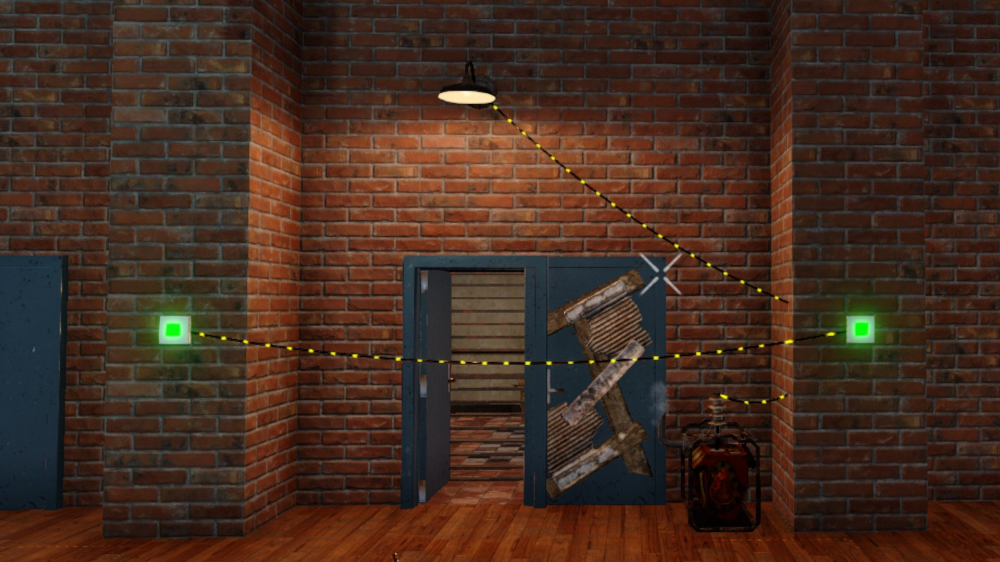

# OCB Electricity Push Button Circuits - 7 Days to Die (1.4) Addon

This mod is not EAC compatible, so you need to turn EAC off!  
Otherwise it should work on linux and also via vortex mod manager.  
Should also work for multiplayer, but hasn't been tested that well yet.

This Mod adds a new block supporting multi-way switching Buttons,
those you often find in hallways, staircases or in living rooms.
Each button in line basically actuates the root button when
pushed. These work similar like regular trigger groups, but
only the root item is actually actuated. These also contribute
to regular trigger groups. You can mix these with other triggers.
Use power relays to break into multiple independent groups.

There is a special mode if you set the power duration to `always`,
or `triggered`, as that option will be auto converted to `always`.
In this mode every push on any button will toggle the root trigger.
This way you can turn lights on and off at any button. You also don't
need to put them in sequence, all belong to the same root trigger.

[![GitHub CI Compile Status][3]][2]

### Download and Install

Simply [download here from GitHub][1] and put into your AppData 7 Days to Die Mods folder:

- https://github.com/OCB7D2D/ElectricityButtonsPush/archive/master.zip

## Changelog

### Version 0.9.0

- Update compatibility for 7D2D 1.4(b8)

### Version 0.8.1

- Refactor code for better Multi-Player compatibility
- Added first Darkness Falls A21 compatibility

### Version 0.8.0

- Update compatibility for 7D2D A21.0(b324)
- Adds Improved 3D model for push button

### Version 0.6.0

- Introducing compatibility for Undead Legacy (experimental)  
  Rename this mod to e.g `ZElectricityPushButton` to load after UL
- Adds (lootable) Push Button Blueprint item
- Push Button is craftable at workstation T2
- ULM Recipes are not set in stone yet ;-)

### Version 0.5.1

- Added localization fix
- Completed German translation

### Version 0.5.0

- A few minor code refactorings and cleanups
- Copied bugfix from ElectricityWorkarounds

### Version 0.4.0

- Refactor for A20 compatibility

## Compatibility

Developed initially for version a20(b218), updated through 1.4(b8).

[1]: https://github.com/OCB7D2D/ElectricityButtonsPush/releases
[2]: https://github.com/OCB7D2D/ElectricityButtonsPush/actions/workflows/ci.yml
[3]: https://github.com/OCB7D2D/ElectricityButtonsPush/actions/workflows/ci.yml/badge.svg
